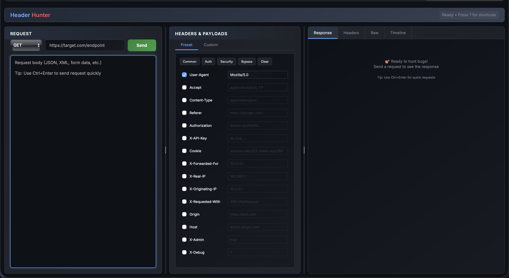

# Header Hunter

**Header Hunter** is a simple, fast, and user-friendly tool for bug bounty hunters and web hackers.  
It lets you easily craft HTTP requests with custom headers, send them to any web app, and inspect the response—all from a clean local web interface.

## 

## Features

-   Edit, add, or remove any HTTP headers (including custom ones)
-   Choose HTTP method (GET, POST, PUT, PATCH, DELETE, etc.)
-   Send requests with custom body data
-   View full response: status, headers, body, and timeline
-   Keyboard shortcuts for speed
-   Runs locally—no data leaves your machine

---

## 🛠️ Installation

1. **Clone the repo:**

    ```sh
    git clone https://github.com/ZeroPvlse/header-hunter.git
    cd header-hunter
    ```

2. **Install dependencies:**

    ```sh
    pip install -r requirements.txt
    ```

3. **Run the app:**

    ```sh
    python header-hunter.py --port [port]
    ```

4. **Open in your browser:**  
   Go to [http://localhost:port](http://localhost:port) or [http://127.0.0.1:port](http://127.0.0.1:port)

---

## 💡 Usage

1. **Enter the target URL** you want to test.
2. **Select the HTTP method** (GET, POST, etc.).
3. **Add or edit headers** in the Headers panel.
4. **(Optional) Add a request body** for POST/PUT/PATCH.
5. **Click "Send"** or press `Ctrl+Enter`.
6. **View the response** in the Response panel.

### Keyboard Shortcuts

-   **Send Request:** `Ctrl+Enter`
-   **Toggle Shortcuts:** `?`
-   **Focus URL:** `Ctrl+L`
-   **Focus Body:** `Ctrl+B`
-   **Add Header:** `Ctrl+H`
-   **Clear Headers:** `Ctrl+Shift+C`

---

## Security & Privacy

-   **Local only:** Never expose Header Hunter to the public internet.
-   **No data leaves your machine:** All requests are sent from your computer.

---

## ️ Disclaimer

Header Hunter is intended **solely for educational purposes and authorized security testing**.  
You are responsible for ensuring you have proper permission before testing any website or system.  
The author is **not liable for any misuse or illegal activity** performed with this tool.

Use responsibly. Happy hunting!
